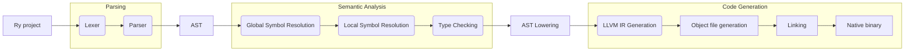

# Ry programming language


An open source programming language for web development with expressive type system and easy-to-learn syntax that makes it easy to build reliable and efficient software.

Example of hello world program:
```ry
import std.io.println;

pub fun main() {
    println("hello world");
}
```

No nulls, we use option types!

```ry
pub fun div[T](a: T, b: T): T? where T: Numeric {
    if b == 0 {
        None
    } else {
        Some(a / b)
    }
}
```

We use result types as well with elvis `?:` and postfix `?` and `!` operators!

```ry
import std.fs.File;

pub fun main() {
    var a = File.open("test.txt")?; // returns (Unit type in this case) if error will occur

    File.open("test2.txt").unwrap(); // panics if error will occur

    var num = "27".parse[i32]() ?: 0; // if error will occur, num will be set to 0
}
```

We use traits like in Rust!

```ry
// example of auto trait
impl[T] Test for T {} 
impl[T] Negative[Test] for T? {} // trait will NOT be implemented for options
impl[T] Negative[Test] for T where T: Default {} // trait will NOT be implemented for types implementing Default 
```

Immutability by default!

```ry
fun main() {
    var a = 3;
    test(&mut a); // error
    test(&a);

    a += 2; // error

    var mut b = 2;
    test(&mut b); // ok
    b += 2; // ok
}
```

Sum types and general traits as well as type aliases!

```ry
pub type A = Sum[B, C];
pub type E = General[D, F];
```

# Builds
<table style="margin-left: auto; margin-right: auto;">
<tr>
<td>Linux - Ubuntu (latest)</td>
<td>


</td>
</tr>
<tr>
<td>Windows (latest)</td>
<td>


</td>
</tr>
</table>

# Installation
## Compiling from source code
You need to have Rust installed on your system. Then run:
<pre>
<b>cargo</b> install --path crates/ry
</pre>
Then you're good to go coding in Ry!

# Documentation
> Not made

# Architecture


