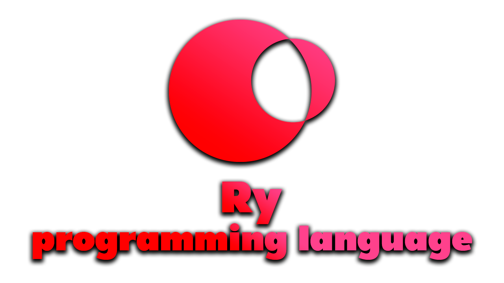

<p align="center"></p>

# Ry programming language


An open source programming language for web development with expressive type system and easy-to-learn syntax that makes it easy to build reliable and efficient software.

Example of hello world program:
```ry
import std.io.println;

pub fun main() {
    println("hello world");
}
```

No nulls, we use option types!

```ry
pub fun div[T](a: T, b: T): Option[T] where T: Numeric {
    if b == 0 {
        None
    } else {
        Some(a / b)
    }
}
```

We use result types as well with `unwrap_or` and postfix `?` and operator!

```ry
import std.fs.File;

pub fun main() {
    var a = File.open("test.txt")?; // returns (Unit type in this case) if error will occur
    var num = "27".parse[i32]().unwrap_or(0); // if error will occur, num will be set to 0
}
```

We use traits like in Rust!

```ry
// example of auto trait
impl[T] Test for T {} 
impl[T] Negative[Test] for Option[T] {} // trait will NOT be implemented for options
impl[T] Negative[Test] for T where T: Default {} // trait will NOT be implemented for types implementing Default 
```

Sum types, dynamic trait dispatchers as well as type aliases!

```ry
pub type A = Sum[B, C];
pub type E = Satisfies[D, F];
```

# Builds
<table style="margin-left: auto; margin-right: auto;">
<tr>
<td>Linux - Ubuntu (latest)</td>
<td>


</td>
</tr>
<tr>
<td>Windows (latest)</td>
<td>


</td>
</tr>
</table>

# Installation
## Compiling from source code
You need to have Rust installed on your system. Then run:
<pre>
<b>cargo</b> install --path crates/ry
</pre>
Then you're good to go coding in Ry!

# Documentation
> Not made

# Architecture

[](https://mermaid.live/edit#pako:eNptUk1v4jAQ_SuWT6mUIvJBITmsRIFS2tCtoNrDJhycZAC3iR05zm5TxH9fx2mhWTGnzHtv5s3Ec8AJTwH7eCdIsUfBKmJIxThc1agQ_BUSuUHX1z_QbUs0UVZxq34moqRsd2aauDUCeAdxpasmRqP5yr71AJa2yUQz03C8ftm0yFQjswt-a8gJkzRBY0ayuqRl13n-f-EZvOuCM2Oe8ZhkaF3nMc_QCkqeVZJy1g56ZwQ8uUh3-2jx3HipC0CTPSRv6m9cXViyHeK-WRIF_C8Ipfvc9l5TiwvbTtTDoDkwEKSx7jovjCD4tUSL1TdFO_tD-DNung1taQZod2LbZ3wMA8rezvadMR-1ZBk-qYI_gGLKiKg32MQ5iJzQVJ3JoVFGWO4hhwj76jOFLakyGeGIHZWUVJKva5ZgX4oKTFwVKZEwpUQtlWN_S7LyhM5SKrk4gQVhvznPvypViv0Dfse-N-jZTt-x3VG_73iuZ5u4xr7ljHpD1-o7jjO0bm4GA_do4g_dwO4NLHc4tEee5Xkj27NMDNpr2R67vvnjP5-Q2EM)
