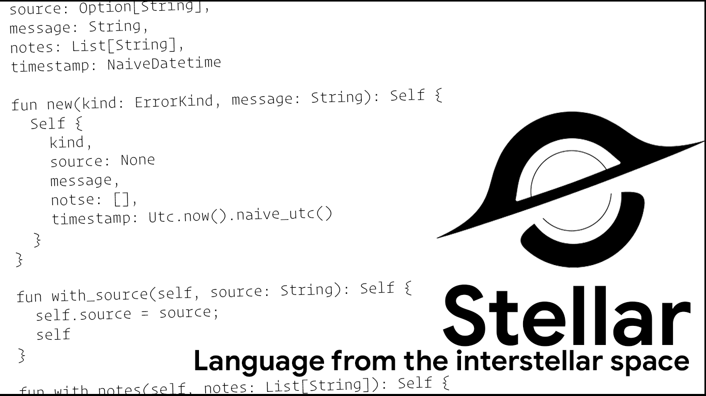

<p align="center">

</p>

# Stellar programming language

Stellar is the language to reduce the cognitive load of your code, but to preserve syntax flexibility and scalability! The language is made by [15 years old teenager](https://github.com/abs0luty) as a hobby project. The language is largely inspired by [Rust](https://github.com/rust-lang/rust), [Gleam](https://github.com/gleam-lang/gleam) and [Go](https://github.com/golang/go). Official reference of the language can be found [here](https://quantumatic.github.io/stellar).

<p align="center">
<details>
  <summary>We're on Discord and Telegram!</summary>
  We have a <a href="https://discord.gg/re29xvSV2">Discord server</a> and a <a href="https://t.me/stellar_lang">Telegram group</a>.
</details>
</p>

# Table of contents

<!--ts-->

- [Introduction](#introduction)
- [Installation](#installation)
- [Roadmap](#roadmap)
<!--te-->

# Introduction

Stellar is an open source programming language for web development with expressive type system and easy-to-learn syntax that makes it easy to build reliable and efficient software.

Example of hello world program:

```
pub fun main() {
    println("hello world");
}
```

# Installation

## Compiling from source code

You need to have Rust installed on your system. Then run:

```
cargo install --path crates/stellar
```

# Roadmap

## 0.1.0

- No runtime yet (no gc and async)
- Simple Cranelift codegen
- No standard library
- No package managment
- No documentation generation

## 0.2.0

- Official website
- Package manager backend
- Package manager website
- Package manager client in the compiler
- Caching results of type checking and compilation in a compiler
- Documentation generation
- GC

## 0.3.0

- LLVM codegen

## 0.4.0

- Official docker image
- Start of the Standard library
- LSP server written in Rust
- LSP client for neovim and vscode (for a while)

## 0.5.0

- Async runtime and more builtin types into a compiler
- More improvements into standart library

## 0.6.0 - 0.29.9

Small pathway into the release stage! A lot of stuff like metaprogramming, optimizations to std and compiler

## 1.0.0

Release (4-5 are required years to achieve that!)
